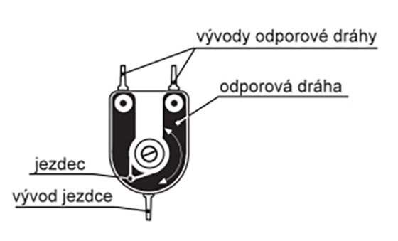
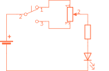
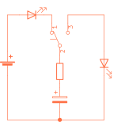

# Electron lekce 2

## 4. AND

Pomocí tohoto obvodu pochopíte princip sériového zapojení spínačů, obvod je zároveň modelem tzv. logické funkce "AND" (česky "a zároveň"). Po propojení dle schématu přepněte přepínač nahoru do polohy "zapnuto" a zmáčkněte tlačítko – rozsvítí se LED. Po uvolnění tlačítka LED zhasne. Pokud přepnete přepínač dolů do polohy "vypnuto", po zmáčknutí tlačítka se LED nerozsvítí. Vyplývá z toho, že LED se při sériovém zapojení spínače a tlačítka rozsvítí jen tehdy, když jsou zároveň sepnuty spínač i tlačítko. Logická funkce obecně vyjadřuje vztah mezi vstupními veličinami, v našem případě stavy spínače a tlačítka (zapnuto nebo vypnuto) a výstupní veličinou, v tomto zapojení je to jas LED. Logická funkce se zapisuje do tabulky. V našem zapojení přiřadíme stavům, kdy jsou tlačítko nebo spínač sepnuty, logickou jedničku ( 1 ) – zapnuto, vypnutému tlačítku nebo spínači logickou nulu ( 0 ) - vypnuto. Pokud LED svítí, budeme brát, že výstupní hodnota je logická 1, pokud nesvítí, je hodnota výstupní veličiny logická 0. 

Ve svém okolí byste našli překvapivé množství aplikaci této i jiných logických funkci. Tak například, pokud si chcete koupit nějakou věc, musí být v obchodě a zároveň musíte mít na ni peníze. Celý fascinující svět počítačů je založen na logických nulách a jedničkách a na neskutečně rychlém provádění logických operaci podle předem sestavených programů.

### Tabulka logických hodnot funkce AND:

| Tlačítko | Spínač | LED       |
|:--------:|:------:|:---------:|
|     0    |    0   |     0     |
|     0    |    1   |     0     |
|     1    |    0   |     0     |
|     1    |    1   |     1     |

## 5. OR

Paralelní neboli souběžné zapojení spínače a tlačítka má tu vlastnost, že LED lze zapnout nezávisle bud tlačítkem nebo spínačem. Na rozdíl od zapojení č.4, kde proud mohl protékat pouze jednou cestou, a to jen pokud byly spínač i tlačítko sepnuty, v tomto zapojení může téci proud buď sepnutým tlačítkem nebo sepnutým spínačem anebo oběma najednou. Tyto vlastnosti odpovídají logické funkci "OR" (česky "nebo"). Pokud opět označíme stavy tlačítka, spínače a LED logickými hodnotami, získáme pro funkci "OR" tabulku níže.

Jako příklad situace vyjadřující tuto logickou funkci lze například uvést: půjdete-li kupovat pečivo, můžete koupit bud rohlík nebo housku anebo také obojí.

### Tabulka logických hodnot funkce OR:

| Tlačítko | Spínač | LED       |
|:--------:|:------:|:---------:|
|     0    |    0   |     0     |
|     0    |    1   |     1     |
|     1    |    0   |     1     |
|     1    |    1   |     1     |

## Úkol navíc

### XOR 

Vyřešte za použití dvou sad Electronu (ve dvojici).
K zapojení si také nakreslete schema. 

|  Vstup 0 | Vstup 1 | LED       |
|:--------:|:-------:|:---------:|
|     0    |    0    |     0     |
|     0    |    1    |     1     |
|     1    |    0    |     1     |
|     1    |    1    |     0     |

## 6. Přepínání barev

Po sestavení se rozsvítí červená nebo žlutá LED podle toho, v jaké poloze se zrovna nachází přepínač. Přepínačem můžete tedy střídat svit červené a žluté LED.

Obvod obsahuje, kromě zdroje napětí, omezovací rezistor 180Ω, který chrání LED před proudovým přetížením a přepínač, který pouští, v závislosti na své poloze, proud do jedné nebo druhé LED.

## 7. Potenciometr jako proměnný rezistor

Zapojte obvod podle schématu. Rozsvítí se LED silně nebo slaběji podle toho, v jaké poloze je regulační knoflík potenciometru. Otáčením regulačního knoflíku lze plynule měnit jas LED.
Pro pochopení funkce potenciometru je dobré vědět, jak je mechanicky konstruován. Pohled na potenciometr bez regulačního knoflíku je na obr 9.2. Odporová dráha podkovovitého tvaru je tvořena vrstvičkou odporového laku, na její konce jsou vodivě připojeny kovové vývody. Mezi těmito vývody je stálý odpor daný vlastnostmi odporové dráhy, ve stavebnici je potenciometr 10 kΩ. Znamená to, že jeho odporová dráha má odpor 10 kΩ. Až potud by byly elektrické vlastnosti shodné s pevným rezistorem. Potenciometr má však navíc tzv. jezdce – plíšek, který se dotýká odporové dráhy v jednom místě a toto místo dotyku se dá otáčením knoflíku měnit. Vyplývá z toho, že odpor mezi jezdcem a některým z konců odporové dráhy je závislý na poloze jezdce a že součet odporů mezi jezdcem a oběma konci dráhy je vždy roven celkovému odporu odporové dráhy. Pokud je jezdec otočen zcela k jednomu konci dráhy, je odpor mezi jezdcem a tímto koncem dráhy téměř nulový, mezi jezdcem a druhým koncem dráhy téměř roven celkovému odporu odporové dráhy. 

Tyto vlastnosti si můžete ověřit, pokud budete měnit polohu regulačního knoflíku a přepínat přepínač. Pokud bude jezdec uprostřed, bude svítit LED při obou polohách přepínače stejně (slabě). Pokud pootočíte regulační knoflík mimo střed, bude při přepínání přepínače měnit LED skokem svůj jas podle toho, jaký odpor je právě mezi jezdcem a koncem odporové dráhy. Opět platí, že čím menší je odpor obvodu, tím větší je proud a také jas LED.

## 8. Prolínání barev

Zapojte obvod dle schématu, rozsvítí se vám jedna nebo obě LED podle toho, v jaké poloze se nachází zrovna jezdec potenciometru. Pokud je jezdec blíže ke krajní poloze "-", svítí jasněji žlutá LED, pokud je blíže poloze "+", svítí jasněji červená LED. Otáčením knoflíku můžete měnit jas obou LED tak, že to vypadá, jako by se světlo "přelévalo" z jedné do druhé.

## 9. Kondenzátor neboli zásobárna energie

Zapojte obvod dle schématu, při zapojování mějte přepínač ve spodní poloze. Nyní přepněte přepínač nahoru a červená LED blikne. Přepněte dolů a blikne žlutá LED. Co se v obvodu odehrálo? Kondenzátor je elektronická součástka, která je schopna uchovat elektrický náboj.
Znamená to, že pokud ke kondenzátoru připojíme zdroj napětí (v našem případě baterii), kondenzátor se nabije a podrží si napětí i po odpojení zdroje. Když nyní připojíme ke kondenzátoru elektrický spotřebič (v našem případě LED), bude se kondenzátor sám po určitou dobu chovat jako zdroj napětí a LED svítí, než se kondenzátor vybije. Při nabíjení teče kondenzátorem proud po dobu, než se napětí kondenzátoru vyrovná s napětím zdroje – to nám signalizuje v našem modelu červená LED. Při vybíjení se rozsvítí žlutá LED. Doba nabíjení a vybíjení kondenzátoru závisí na jeho kapacitě (čím větší kapacita, tím je doba delší) a velikosti elektrického proudu, kterým se kondenzátor nabijí nebo vybíjí (čím menší je proud, tím déle probíhá nabíjení nebo vybíjení). V našem obvodu je proud omezen pouze rezistorem 180 Ω, takže nabíjení a vybíjení probíhá rychle a LED svítí jen krátce. Kdybychom chtěli délku svitu prodloužit, museli bychom kondenzátor nabíjet přes větší rezistor, proud by byl ovšem malý na to, aby rozsvítil LED plným jasem. Tento problém je snadno řešitelný použitím tranzistoru, což si budete moci vyzkoušet v dalších zapojeních. Jednotka kapacity kondenzátoru je 1 F (Farad), v praxi se ovšem používají kondenzátory s kapacitou mnohonásobně menší, než 1 F, tomu odpovídají i běžně používané jednotky:

1 µF (čti mikrofarad)  =   1 miliontina faradu   
1 nF (čti nanofarad)   =   1 tisícina mikrofaradu   
1 pF (čti pikofarad)    =   1 tisícina nanofaradu   

Ve schématech se už většinou nepíše písmeno "F"- značka Faradu za hodnotu kondenzátoru, protože je zřejmé ze schématické značky, že jde o kondenzátor a hodnota je ve Faradech.

Při experimentování a zapojování elektrolytických kondenzátorů do obvodu je nutno dbát, aby vývod "+" byl připojen na vyšší napětí, než vývod "-". Při dlouhodobějším opačném připojení by mohlo dojít k poškození kondenzátoru.

