# Manuál

## Potřebný materiál
- Deska plošných spojů
- 3 Diody 1N4148
- 3 rezistory 10kΩ
- 3 rezistory 4.7MΩ
- 5 rezistorů 1kΩ
- 4 kondezátory 100nF
- 1 tranzistor BC547B
- 1 tranzistor BC557B
- 7 LED
- tlačítko
- 2 integrované obvody (CD4029N a NE555N)
- podložku pod USB konektor

## Návod na složení
1. Připravíme si desku pro hrací kostku 
!!! Pozor danger
    Pozor, v bedně se nachází desky v1.1 a v1.2. Tento návod je pro verzi **v1.2**
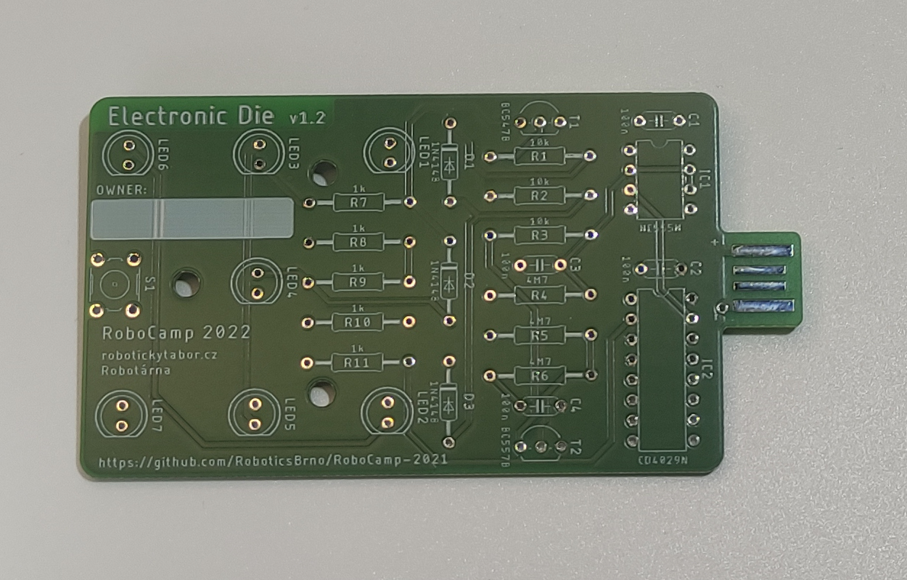 

2. Osadíme 3 diody <b>1N4148</b> (D1, D2, D3)
!!! Pozor danger
    **Pozor na polaritu!** Je třeba mít černý proužek na diodě na stejné straně, jako je naznačeno bílým proužkem na desce. 
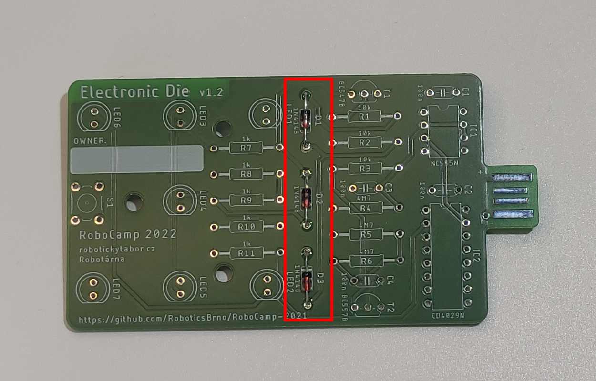 

3. Osadíme 3 rezistory <b>10 kΩ</b> (R1, R2, R3)  
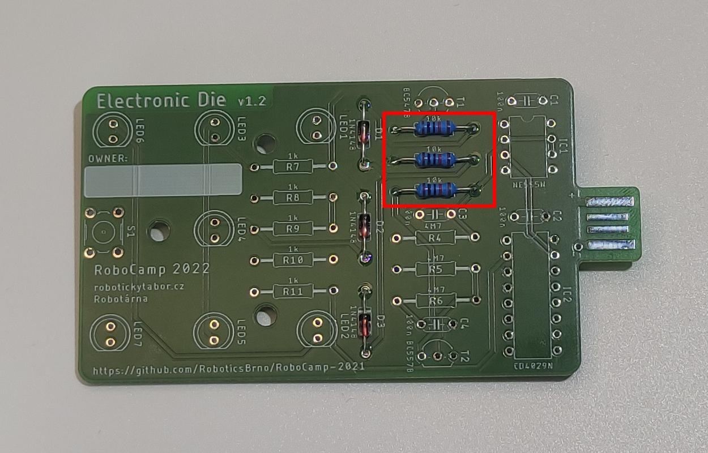 

4. Osadíme 3 rezistory <b>4,7 MΩ</b> (R4, R5, R6) 
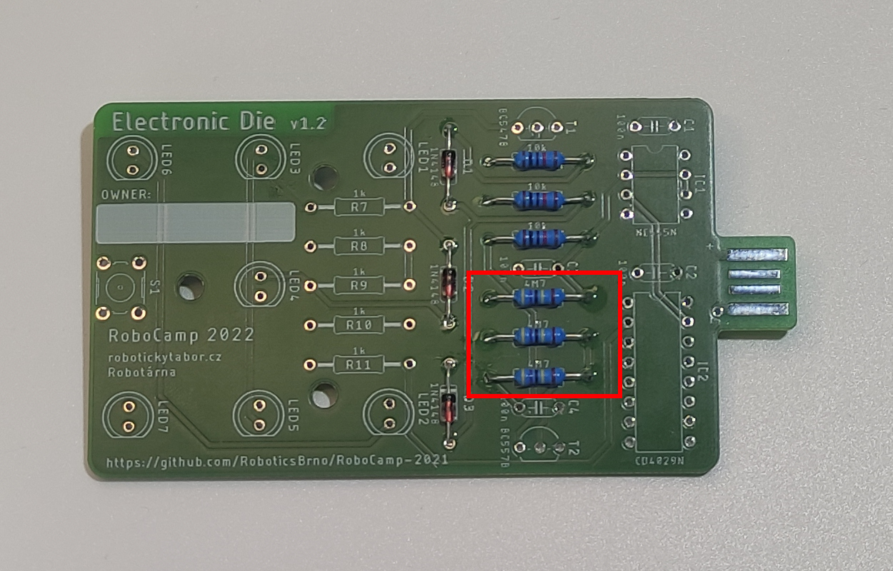 

5. Osadíme 5 rezistorů <b>1 kΩ</b> (R7, R8, R9, R10, R11) 
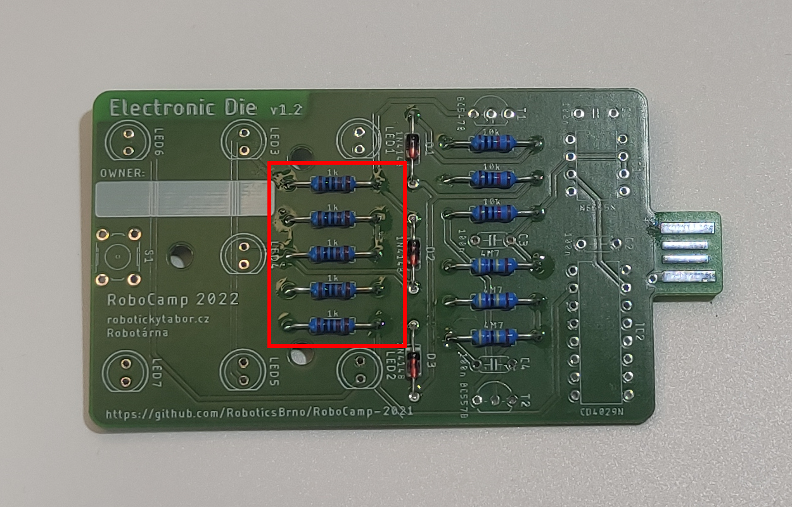 

6. Osadíme 4 kondenzátory <b>100 nF</b> (C1, C2, C3, C4) 
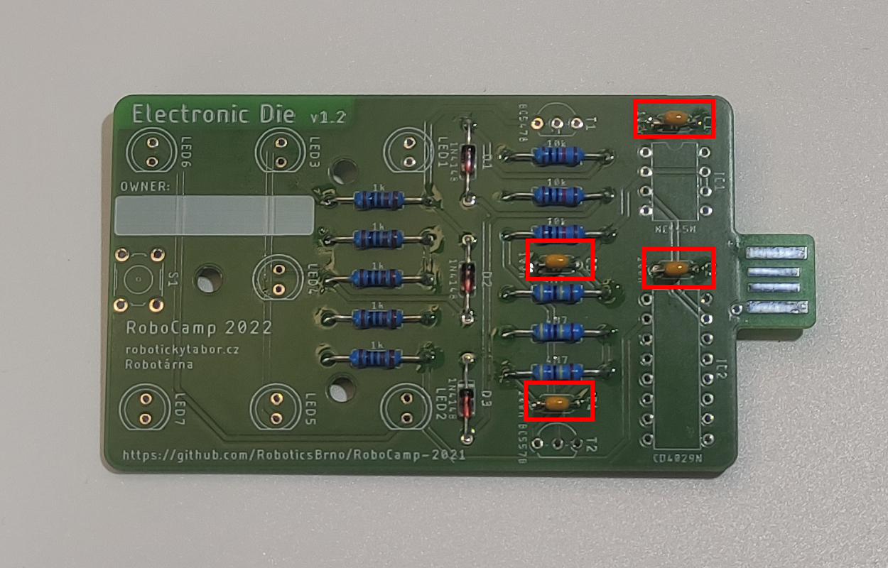 

7. Osadíme 1 tranzistor <b>BC547B</b> (T1) 
!!! Pozor danger
    Je třeba dodržet orientaci dle naznačení na desce! 
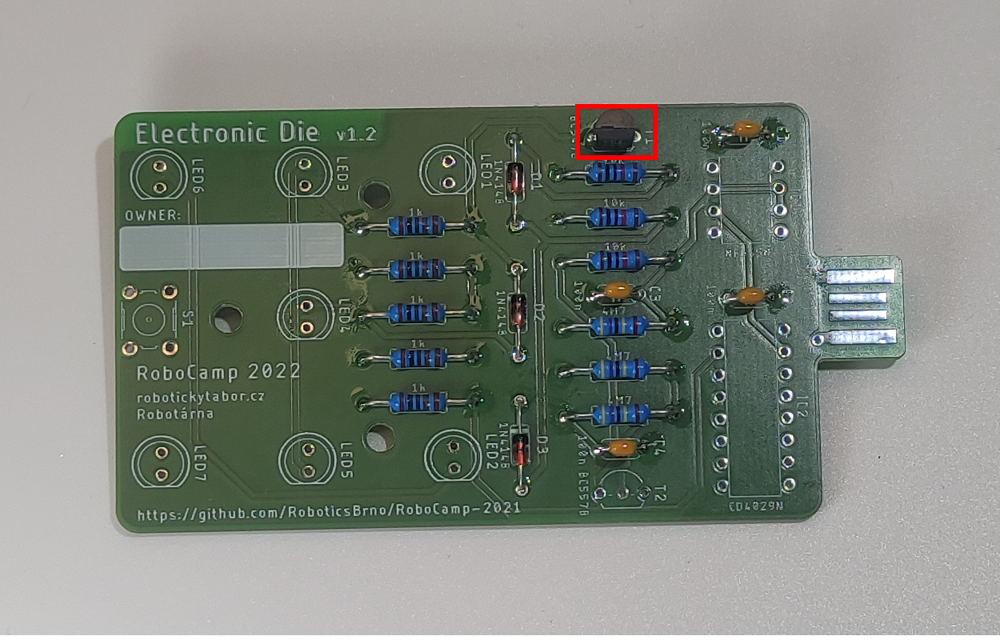 

8. Osadíme 1 tranzistor <b>BC557B</b> (T2) 
!!! Pozor danger
    Opět je třeba dodržet otočení dle nákresu na desce!</b> 
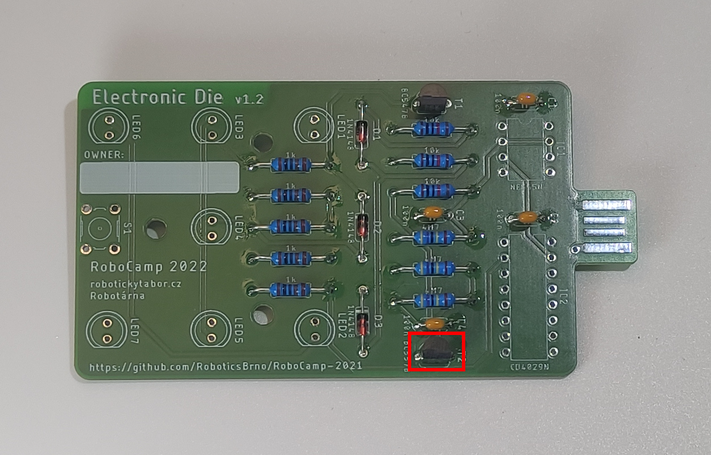 

9. Osadíme 7 <b>červených LEDek</b> (LED1, LED2, LED3, LED4, LED5, LED6, LED7)  
!!! Pozor danger 
    Je třeba dodržet otočení dle nákresu na desce!
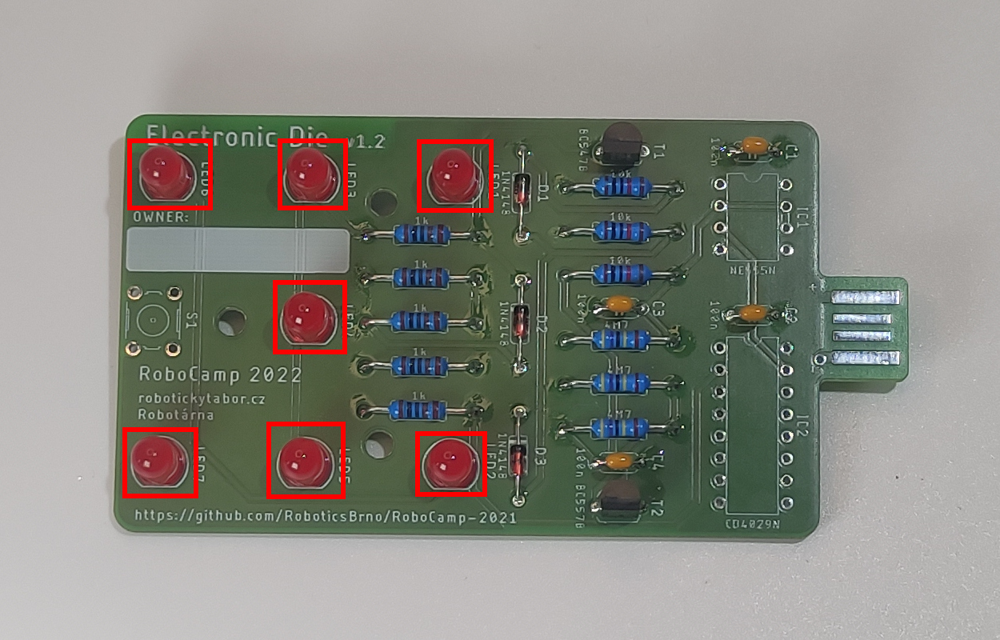 

10. Osadíme <b>tlačítko</b> (S1) 
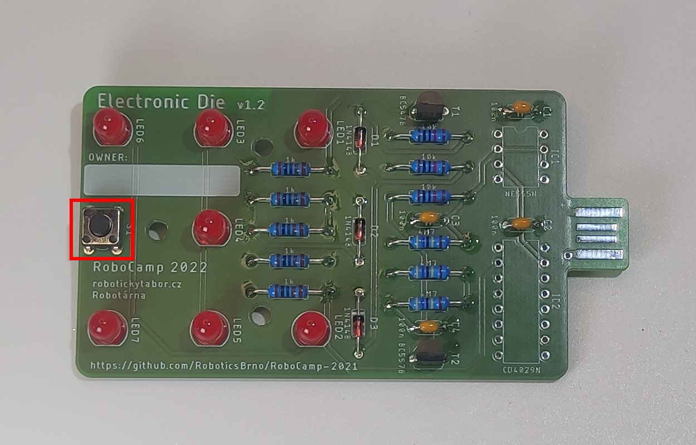 

11. Osadíme 2 integrované obvody (IC1, IC2) 
!!! Pozor danger
    Je třeba dodržet orientaci! Kolečko na pouzdře obvodu musí být v levém horním rohu na desce! Pokud si nejste otočením jisti, zeptejte se raději lektora. 
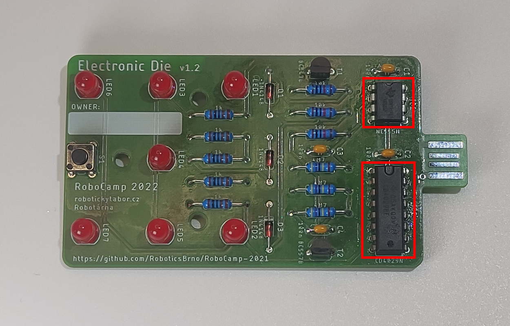 
<!--  
12. 

 -->

<!--  
29. 

 -->

12. Připravíme si vteřinové lepidlo a podložku pod USB konektor 
!!! Pozor danger
    Lepidlo je silné, vždy lep na nějaké podložce
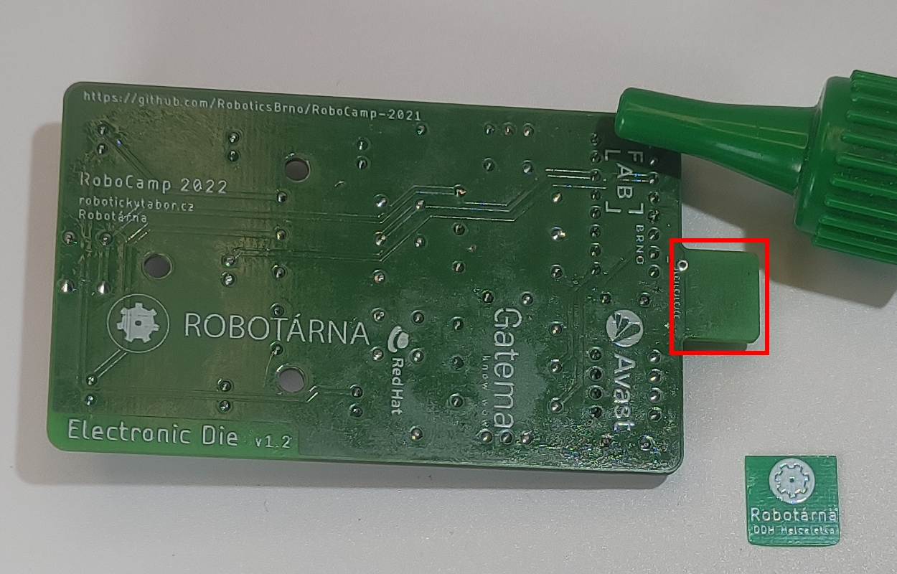 

13. Podlepíme USB konektor podle fotky 
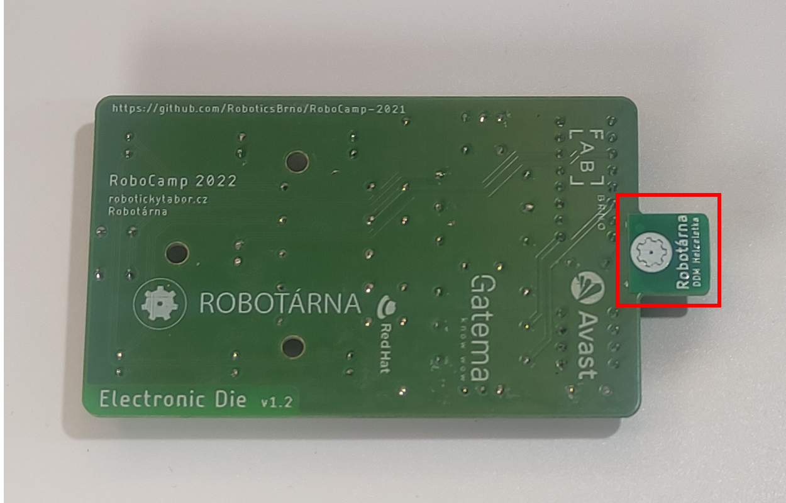 

14. Dokončená hrací kostka 
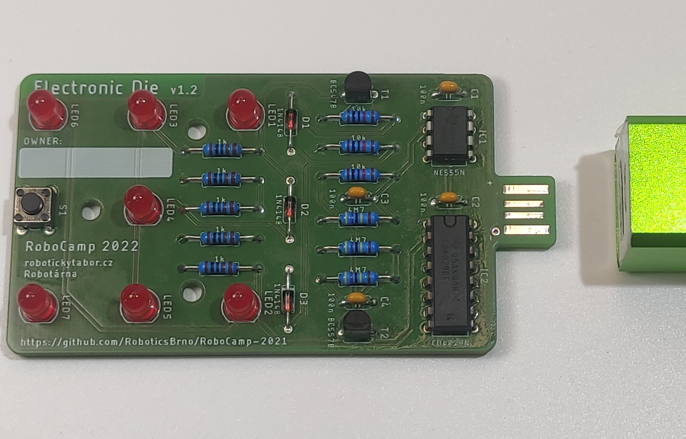 

15. Svítící hrací kostka zapojená v powerbance 
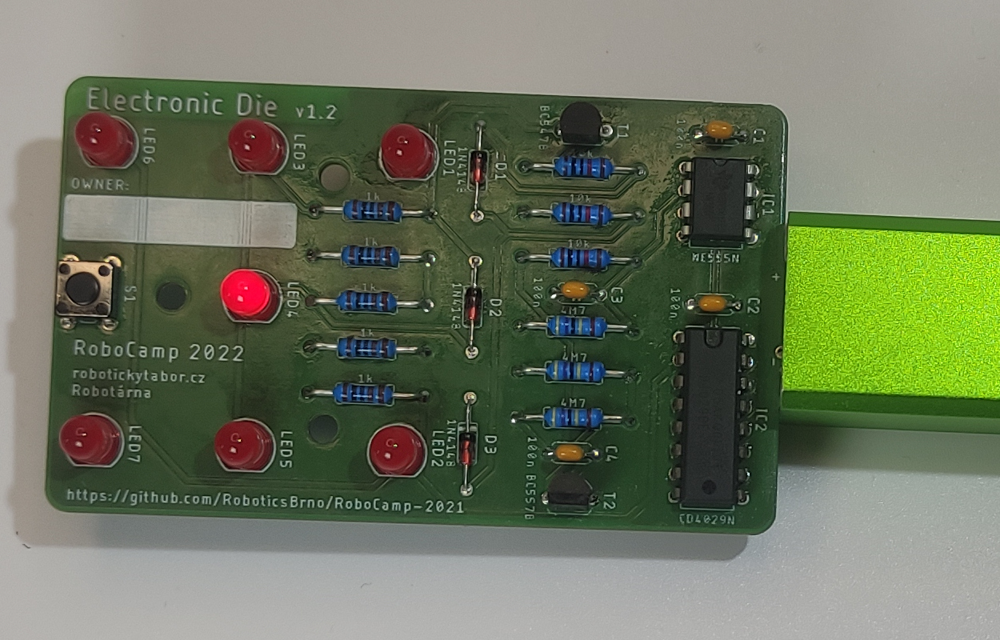 

