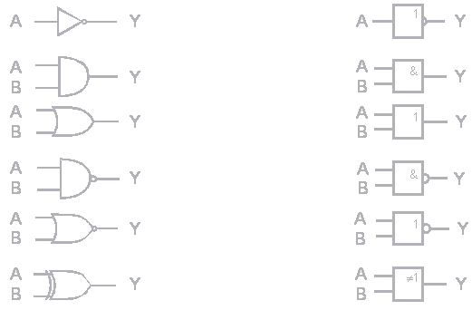

# O co jde?

Hradlo neboli logický člen je základní stavební prvek logických obvodů, který vyčísluje logickou funkci. 
Hradla mají vstupy a typicky jediný výstup. Hodnota na výstupu logického členu je funkcí hodnot vstupních, což znamená, že logická hodnota výstupu je závislá jen na hodnotě vstupu. Naše hradla jsou složena z jednotlivých tranzistorů a rezistoru, které si sami zapájíte tak, aby fungovaly jako logické hradla.

## Značení
Existují dva způsoby značení logických členů (oba definované ANSI/IEEE Std 91-1984 a jeho dodatkem ANSI/IEEE Std 91a-1991). Prvním jsou obdélníkové (čtvercové) značky (IEC, DIN). Druhým způsobem jsou značky složené z křivek (ANSI), které jsou rozšířeny v profesionálních systémech pro návrh logických obvodů. U obou způsobů značení existují v praxi drobné varianty. Negovaný výstup je často označen kolečkem.

## Pravdivostní tabulka
Pro ujasnění funkce jednotlivých hradel se používají pravdivostní tabulky, ze kterých je jasně vidět jaké výstupy jsou vytvoří danými vstupy.

### NOT
V programovacích jazycích se obvykle označuje znakem `!`.

| vstup |                 výstup                 |
| :---: | :------------------------------------: |
|   0   | **1** |
|   1   | **0** |

### AND
V programovacích jazycích se obvykle označuje znakem `&` nebo `&&`.

| vstup-1 | vstup-2 | **výstupy** |
| :-----: | :-----: | :------------------------------------------: |
|    0    |    0    | **   0   ** |
|    0    |    1    | **   0   ** |
|    1    |    0    | **   0   ** |
|    1    |    1    | **   1   ** |

### OR
V programovacích jazycích se obvykle označuje znakem `|` nebo `||`.

| vstup-1 | vstup-2 | **výstupy** |
| :-----: | :-----: | :------------------------------------------: |
|    0    |    0    | **   0   ** |
|    0    |    1    | **   1   ** |
|    1    |    0    | **   1   ** |
|    1    |    1    | **   1   ** |

### NAND
Toto hradlo můžete vytvořit pomocí `AND` jehož výstup znegujete (přivedete na `NOT`).

| vstup-1 | vstup-2 | **výstupy** |
| :-----: | :-----: | :------------------------------------------: |
|    0    |    0    | **   1   ** |
|    0    |    1    | **   1   ** |
|    1    |    0    | **   1   ** |
|    1    |    1    | **   0   ** |

### XOR
V programovacích jazycích se obvykle označuje znakem `^` nebo `^^`.

| vstup-1 | vstup-2 | **výstupy** |
| :-----: | :-----: | :------------------------------------------: |
|    0    |    0    | **   0   ** |
|    0    |    1    | **   1   ** |
|    1    |    0    | **   1   ** |
|    1    |    1    | **   0   ** |

## Terminologie
Někdy se pojmy logický člen a hradlo rozlišují. Pojem hradlo pak označuje fyzickou součástku (např. integrovaný obvod), zatímco pod pojmem logický člen je myšlen prvek realizující logickou funkci.
