# Manuál

## Potřebný materiál
- Deska plošných spojů
- 4 LED
- 21 rezistorů 10kΩ
- 7 tlačítek
- 12 tranzistorů

## Návod na složení
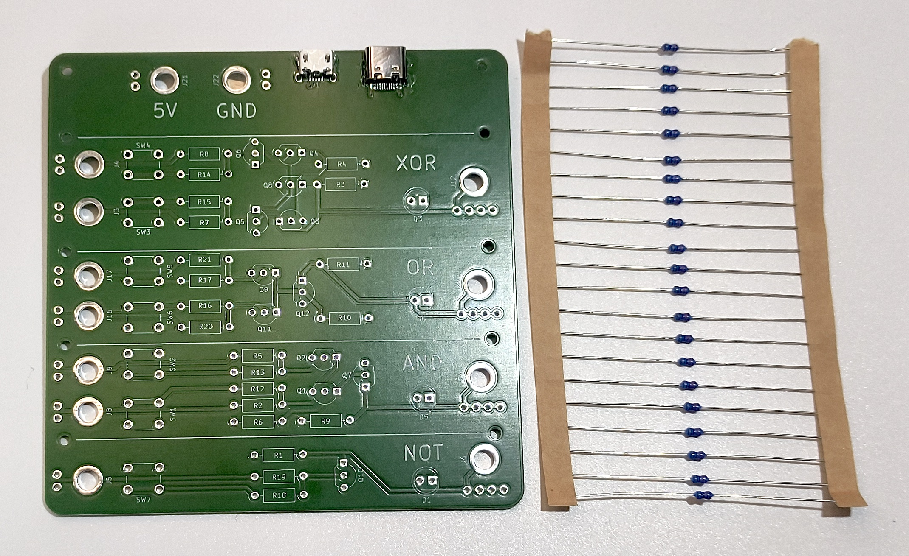 
1. Připravíme si 21 rezistor 10kΩ

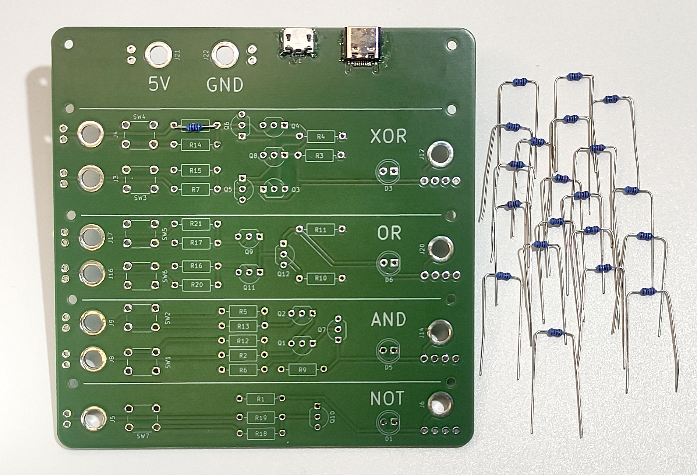 
2. Naohýbáme si nožičky všech jednadvaceti rezistorů, tak aby šly lehce zasunout na pozice na desce

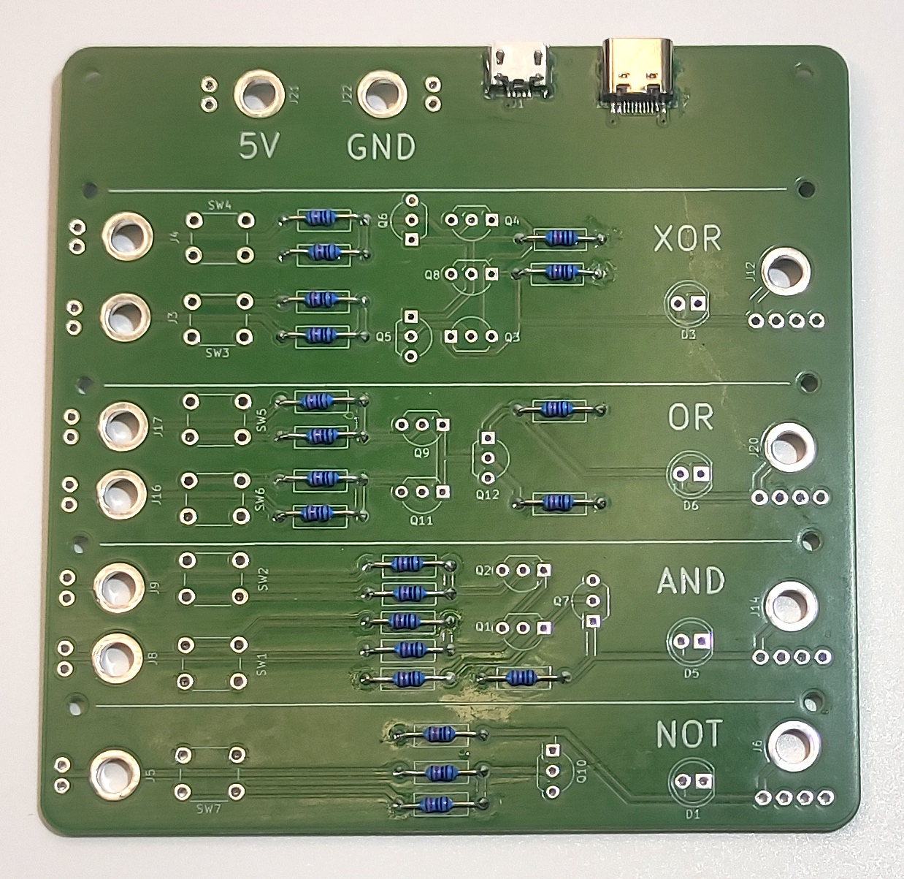 
3. Všechny rezistory umístíme na pozice rezistorů na desce a zapájíme.
Při pájení nezapomeňte na <b>tavidlo</b>.

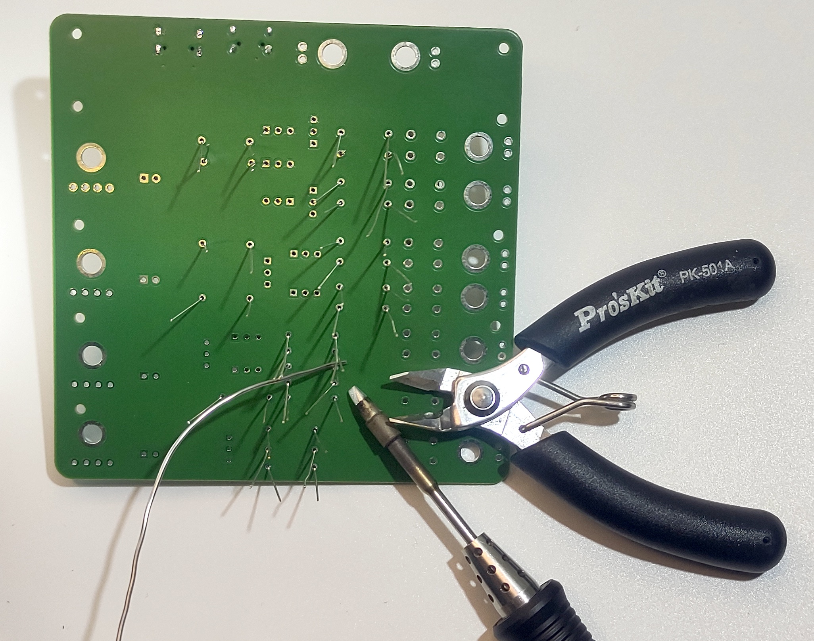 
4. Po zapájení zastřihneme nožičky rezistorů 

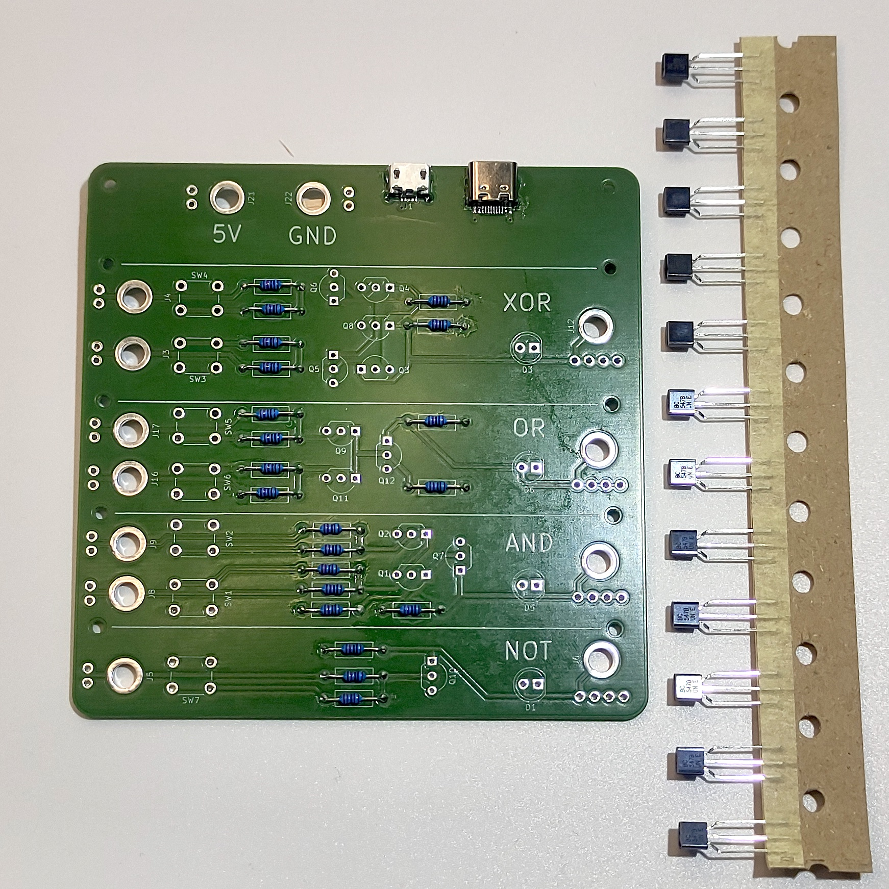 
5. Připravíme si všech 12 tranzistorů

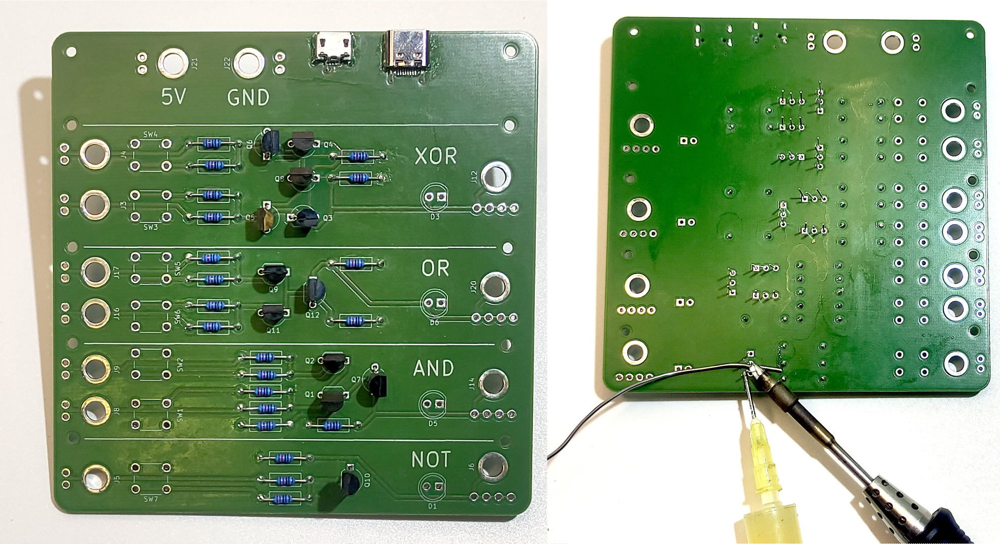
6. Tranzistory umístíme do desky a zapájíme

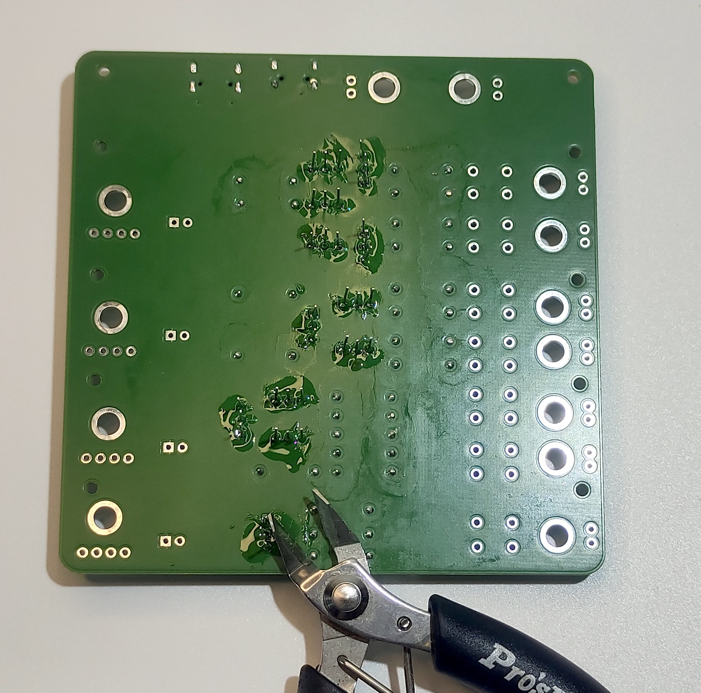 
7. Zastřihneme přečuhující nožičky tranzistorů

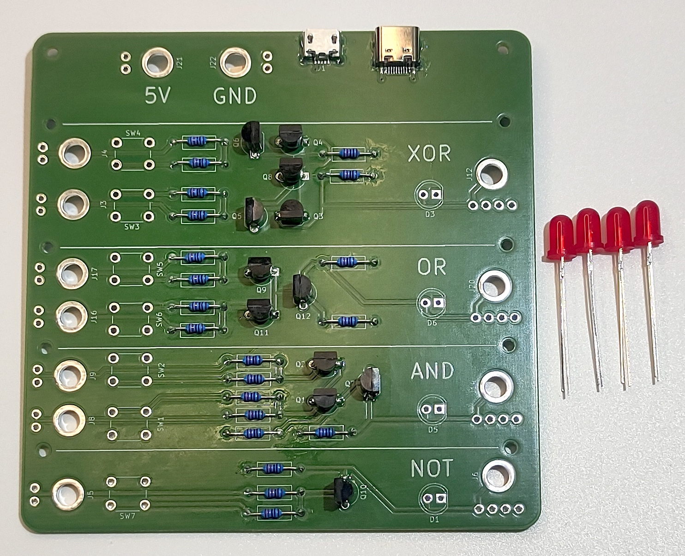 
8. Připravíme si čtyři LEDky

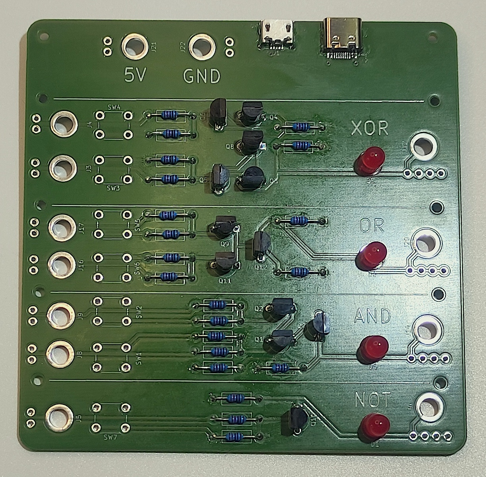 
9. Zapájíme LEDky pokud možno tak aby byly z desky kousek povystrčené

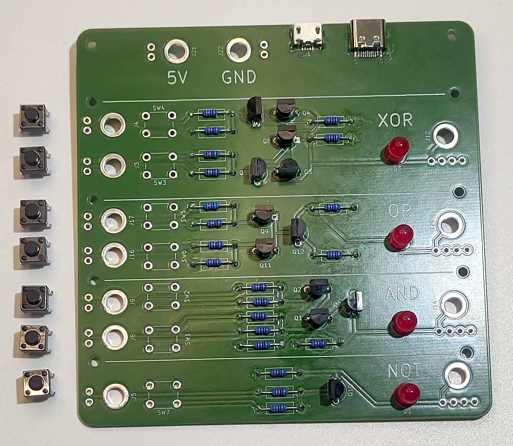 
10. Nachystáme si sedm tlačítek

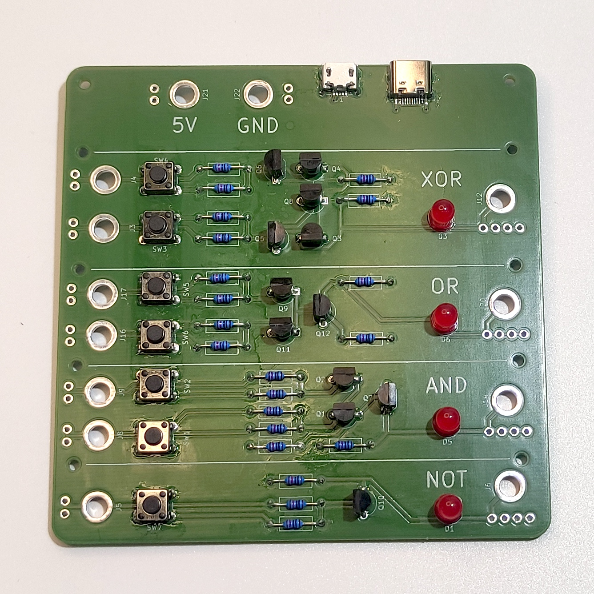 
11. Zapájíme tlačítka do desky

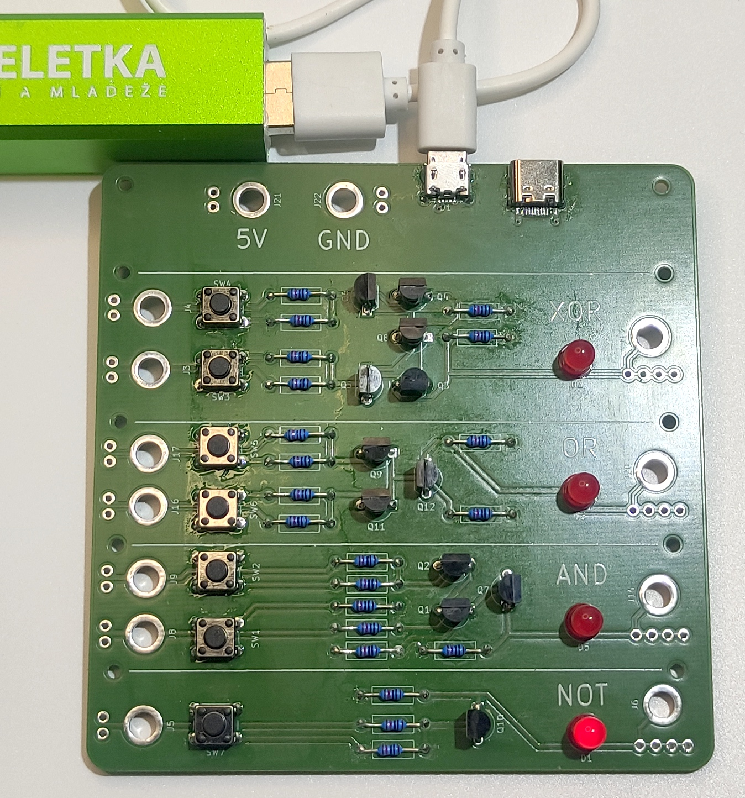 
12. Necháme si desku u vedoucího umýt a máme hotovo 😉

