# Manuál

## Potřebný materiál
- Dřevěný dílek
- 7 LED
- 1 rezistor
- Držák baterie
- Baterie CR2032

## Návod na složení
1. Připravíme si potřebný materiál 
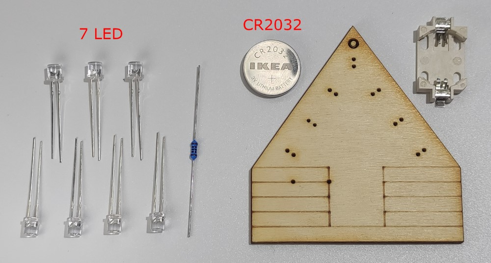 

2. Vložíme 2 LEDky podle znázornění na obrázku 
!!! Pozor danger
    Je potřeba dát pozor na natočení LEDek - propouští proud pouze jedním směrem!
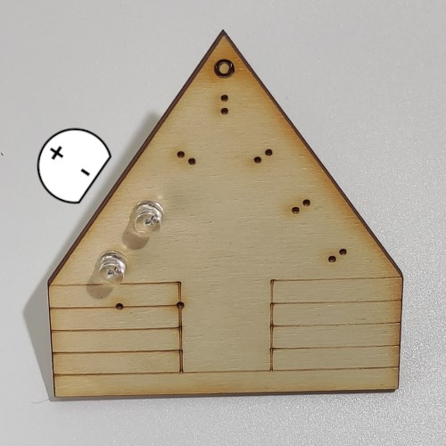 

3. LEDku dotlačíme k překližce 
!!! Pozor danger
    Mezi ledkou a překližkou nesmí zbýt žádný volný prostor!
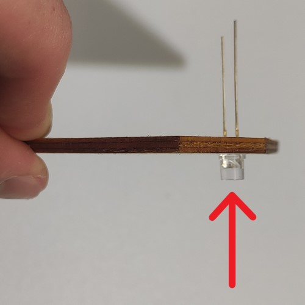 

4. Ohneme vnější nožičku LEDky podle šipky 
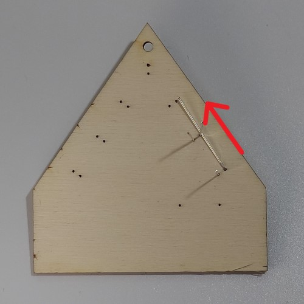 

5. Vložíme a ohneme <b>vnější</b> nožičky všech ostatních LEDek 
!!! Pozor danger
    Dotýkat se mezi sebou musí vždy nožičky reprezentující stejnou polaritu!
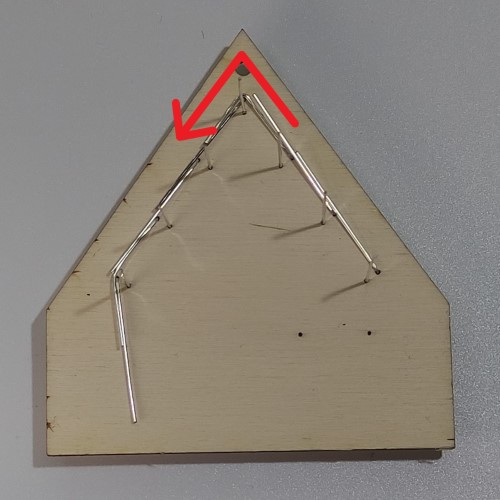 

6. Ohnuté nožičky zapájíme dohromady 
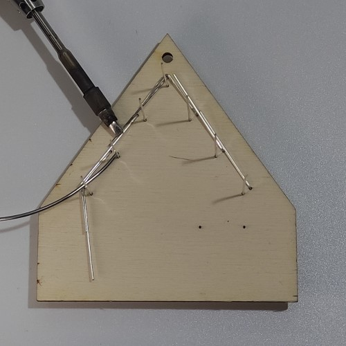 

7. Vnější nožičky jsou zapájené 
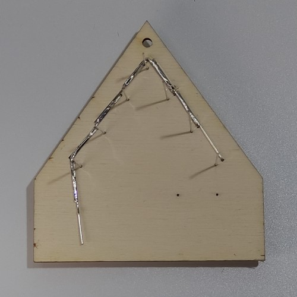 

8. Ohneme všechny vnitřní nožičky LEDek 
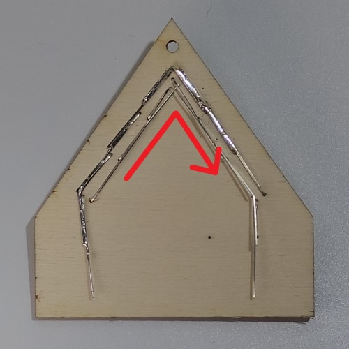 

9. Zapájíme vnitřní nožičky LEDek dohromady 
!!! Pozor danger
    Při pájení si dej velký pozor, aby se byla oddělená horní skupina nožiček od dolní! Došlo by ke **zkratu**
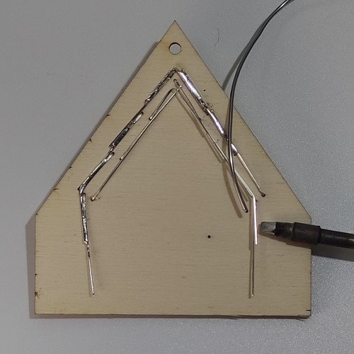 

10. Vnitřní nožičky jsou zapájené 
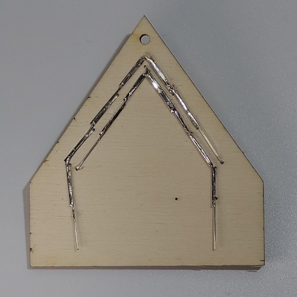 

11. Vložíme rezistor podle obrázku a dotlačíme ho k překližce 
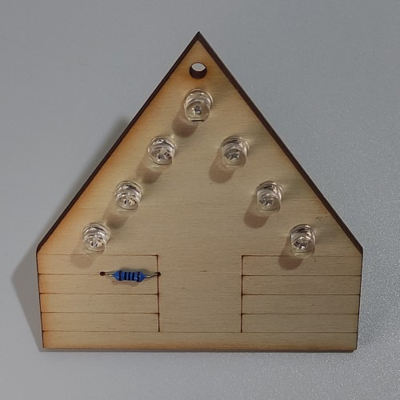 

12. Spodní pohled na desku 
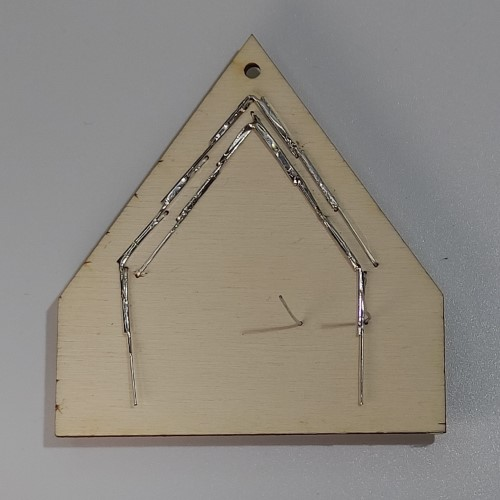 

13. Ohneme <b>vnější</b> nožičku a připájíme k <b>vnitřní</b> skupině LEDek 
!!! Pozor danger
    Opět si dáváme pozor na **zkrat**!
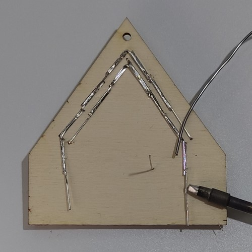 

14. Zakrátíme nožičku rezistoru podle obrázku 
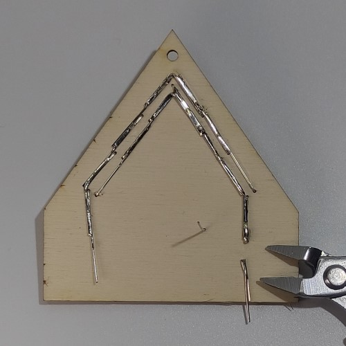 

15. Nachystáme si držák na baterii 
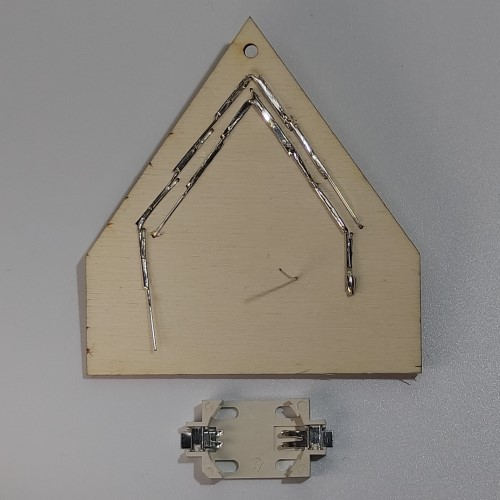 

16. Držák kapkou lepidla přilepíme k překližce jako na obrázku 
!!! Pozor danger
    Při vkládání nezapomeň dát pozor na polaritu, zkontroluj, že postupuješ dle obrázku!
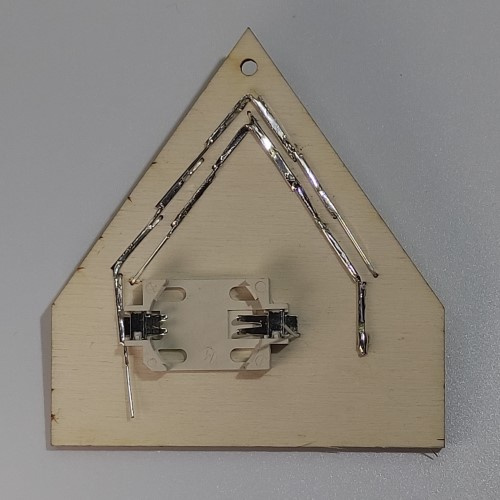 

17. K držáku baterií připájíme rezistor a nožičku LEDky 
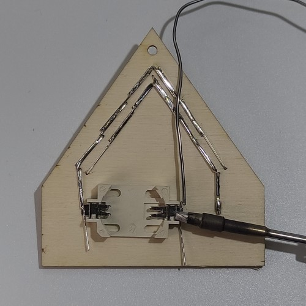 

18. Zakrátíme nožičku rezistoru a LEDky podle obrázku 
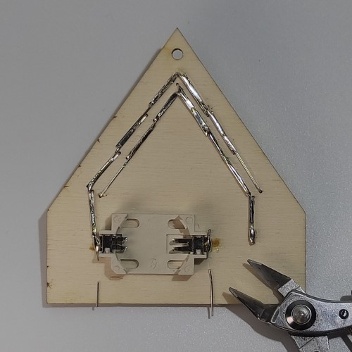 

18. Vložíme baterku 
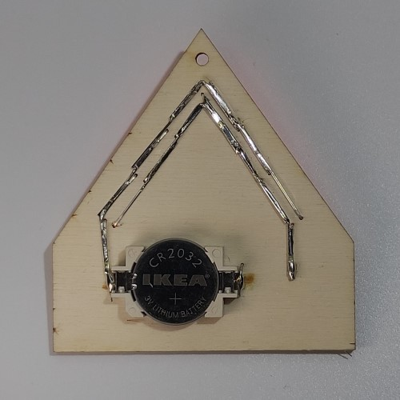 

20. Dokončený RoboCamp 
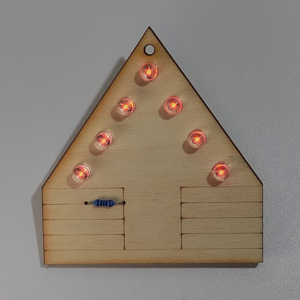 

