# Manuál

## Potřebný materiál
- Dřevěný dílek
- 7 LED
- 1 rezistor
- Držák baterie
- Baterie CR2032

## Návod na složení
1. Připravíme si potřebný materiál 
    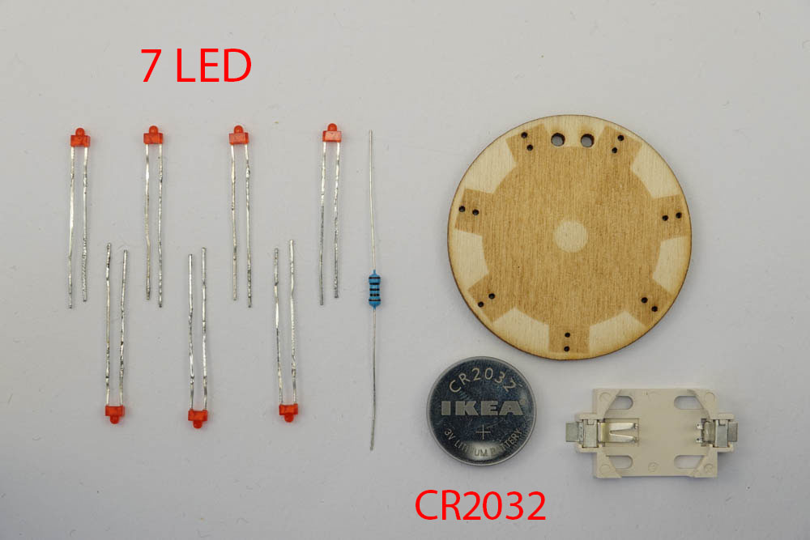 
    

2. Vložíme 2 LEDky podle znázornění na obrázku 

    !!! Pozor danger
        Dávej pozor pozor na orientaci ledek, propouští proud pouze jedním směrem!

    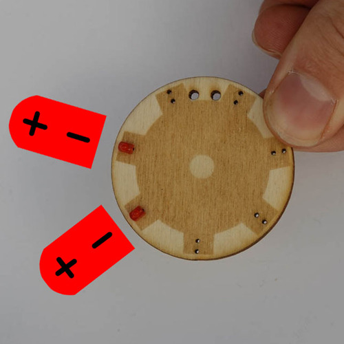 
    

3. LEDku dotlačíme k překližce 

    !!! Pozor danger
        Mezi ledkou a překližkou nesmí být žádný volný prostor, jinak hrozí ulomení a zkrat!

    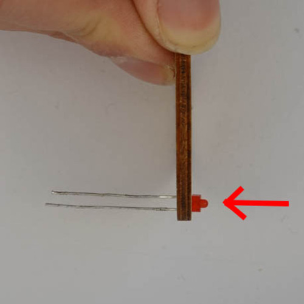 
    

4. Ohneme vnější nožičku LEDky podle šipky 
    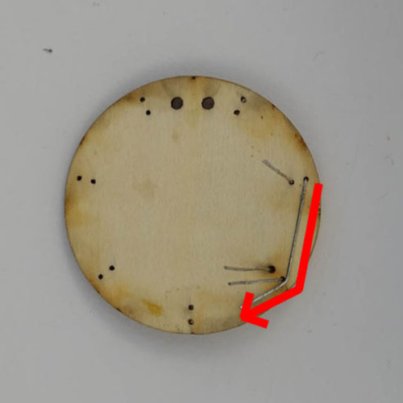 
    

5. Vložíme a ohneme další nožičku LEDky 

    !!! Pozor danger
        Nezapomínáme na to, že je potřeba dodržet polaritu LEDek! Nově přidané LEDky musí mířit stejným směrem, jako ty "už umístěné".

    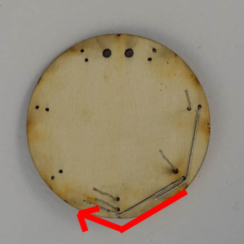 
    

6. Proces opakujeme celkem sedmkrát 

    !!! Pozor danger
        V průběhu nezapomínáme na polarizaci!

    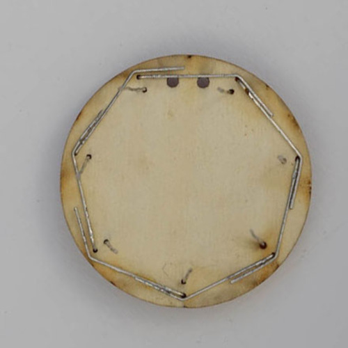 
    

7. Vnější kružnici zapájíme dohromady 
    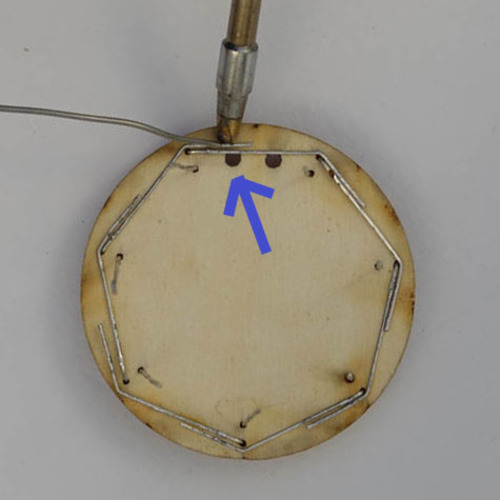 
    

8. Ohneme vnitřní nožičku LEDky podle šipky 
    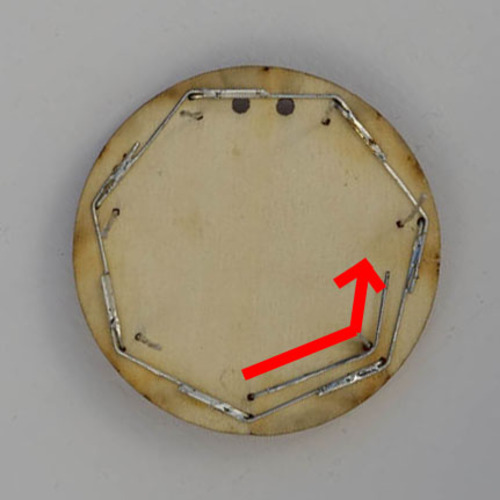 
    

9. Pokračujeme v ohýbání LEDek 
    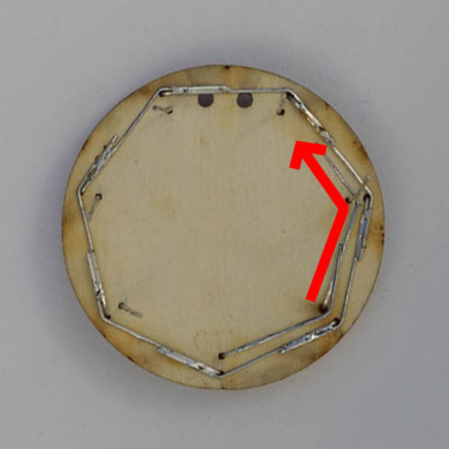 
    

10. Postupně zohneme všechny nožičky LEDek 
    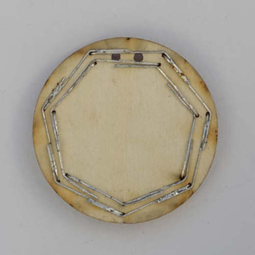 
    

11. Zapájíme vnitřní kružnici 

    !!! Pozor danger
        Vnitřní a vnější kružnice nožiček se nikdy nesmí protnout! Jinak vznikne **zkrat**!

    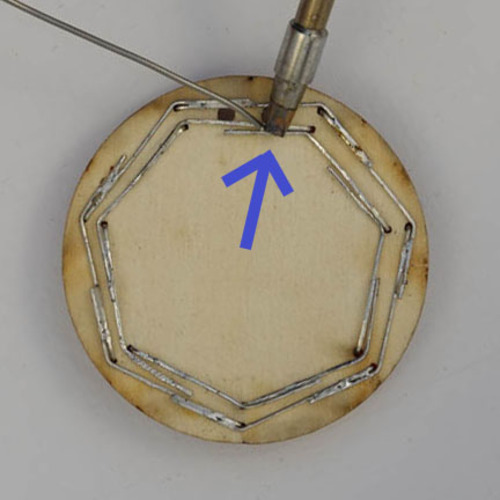 
    

12. Na držák baterky naneseme kapku lepidla 
    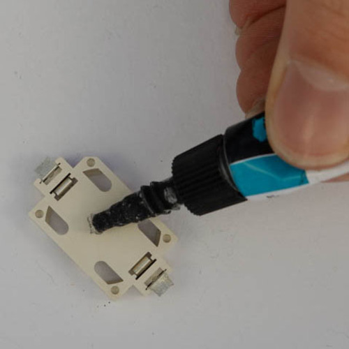 
    

13. Držák přitiskneme pod drátky tak, aby se záporná polarita dotýkala vnitřního okruhu 

    !!! Pozor danger
        U držáku musíme dát pozor na polaritu!

    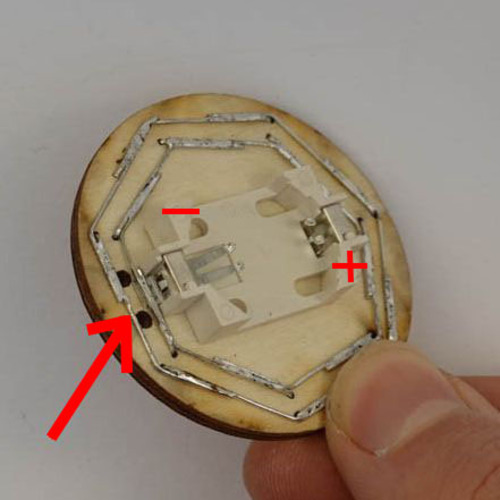 
    

14. Připájíme držák k vnitřnímu kruhu LEDek 
    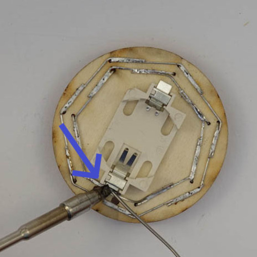 
    

15. Zakrátíme nožičku rezistoru podle šipky 
    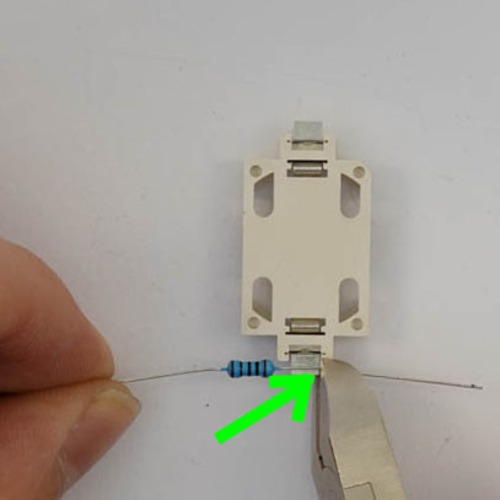 
    

16. Připájíme rezistor k držáku baterií 

    !!! Pozor danger
        Rezistor připojujeme na druhou stranu, než jsme připájeli baterii k vnitřnímu kruhu nožiček LEDek

    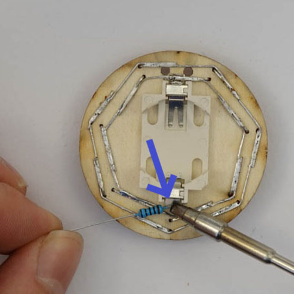 
    

17. Zakrátíme nožičku rezistoru podle šipky 
    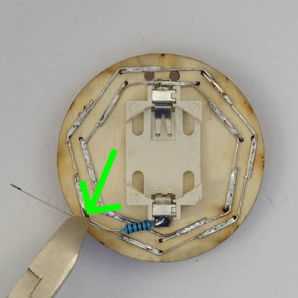 
    

18. Připájíme rezistor ke vnější kružnici 

    !!! Pozor danger
        Při pájení musíme dát pozor na **zkrat**! Rezistor se nesmí dotýkat vnitřního kruhu nožiček
        
    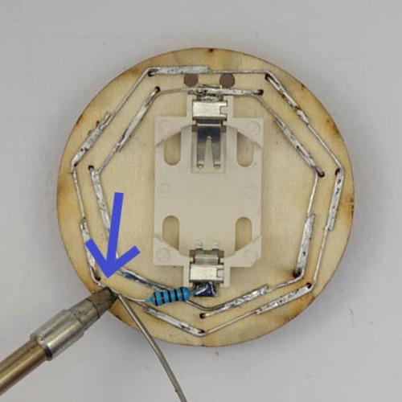 
    

19. Vložíme baterku 
    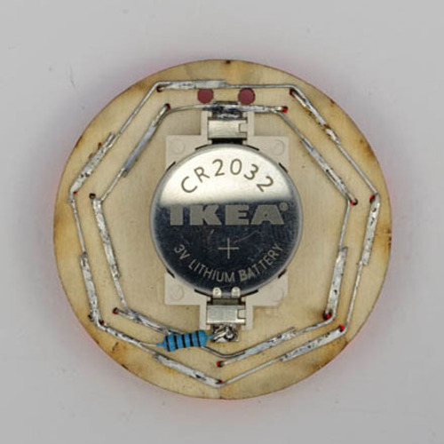 
    

20. Dokončený RoboSvit 
    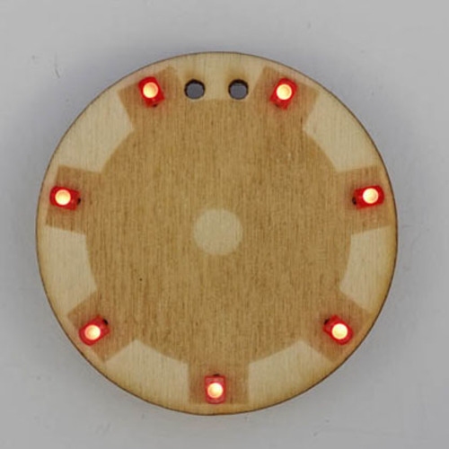 
    

Vytvořil s láskou Jakub Andrýsek.