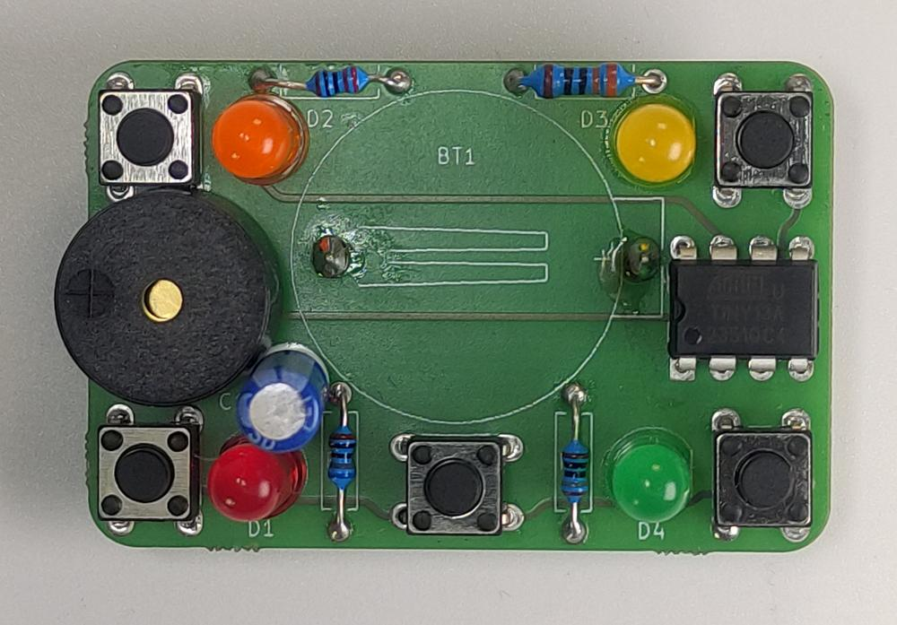

# O co jde?

Simon Says je jednoduchá elektronická hra, která testuje vaši paměť a rychlost reakce. Hra se skládá z několika tlačítek a barevných LED diod, které se postupně rozsvěcují. Vaším úkolem je stisknout tlačítka v pořadí, ve kterém se rozsvítila. Čím déle hrajete, tím složitější sekvence se objevují.

{{ manual_button() }}

 

Výrobek převzat v rámci spolupráce s [ÚDIF](https://www.udif.cz)