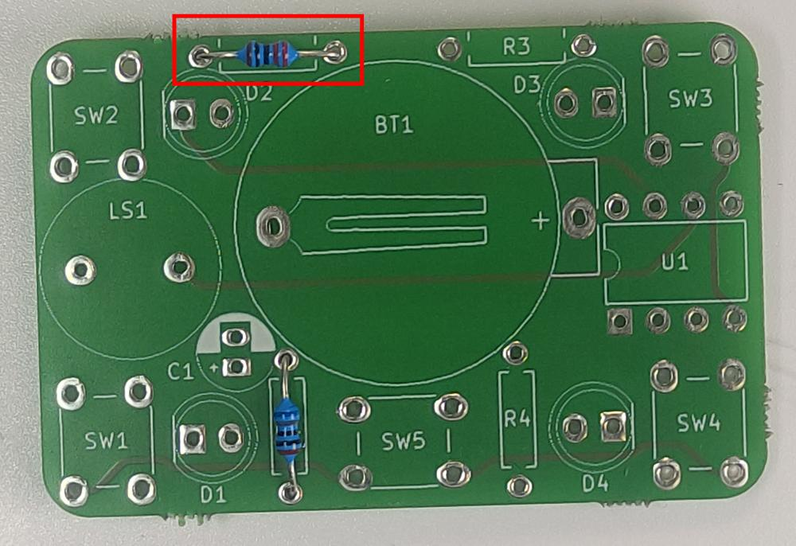
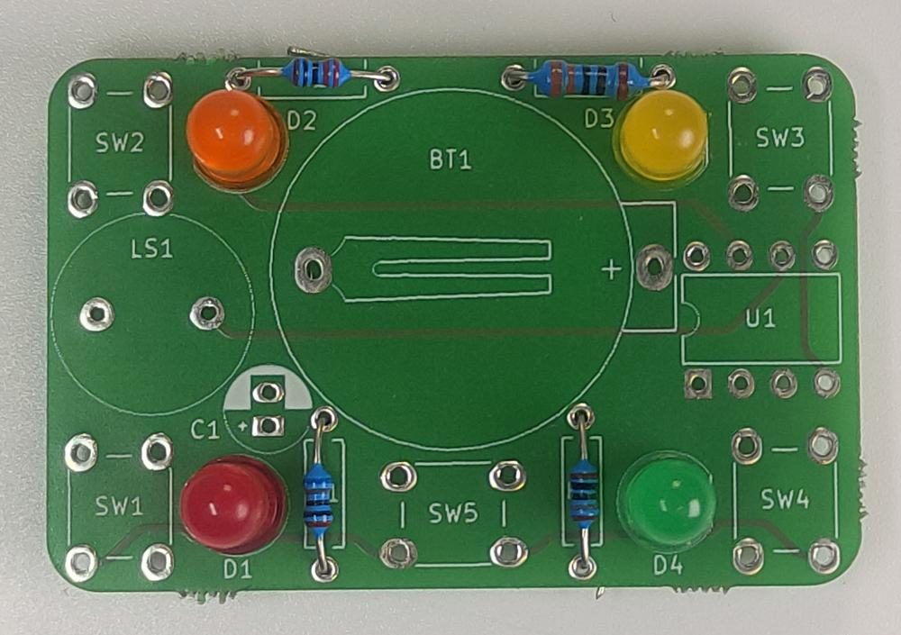
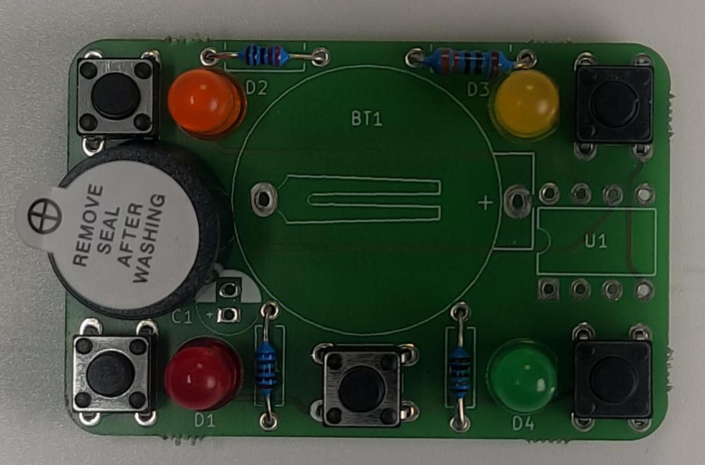
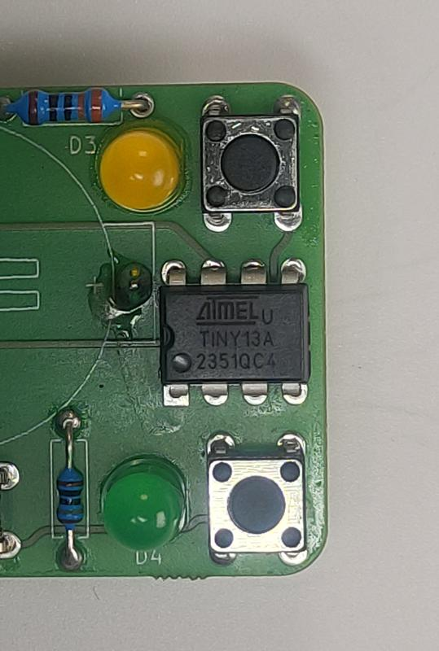

# Návod

## Potřebný materiál
- Deska plošných spojů
- 1x rezistor 680 Ohm
- 1x rezistor 220 Ohm
- 1x rezistor 330 Ohm
- 1x rezistor 180 Ohm
- 1x každá barva LED (zelená, žlutá, oranžová a červená)
- 5x tlačítko
- 1x piezo bzučák
- 1x kondenzátor 100uF
- 1x integrovaný obvod
- 1x držák baterie

## Návod na složení

 
0. Vezmeme desku plošných spojů

 
1. Osadíme rezistor o hodnotě **680Ω** na místo R1

 
2. Osadíme rezistor o hodnotě **220Ω** na místo R2

 
3. Osadíme rezistor o hodnotě **330Ω** na místo R3

 
4. Osadíme rezistor o hodnotě **180Ω** na místo R4

 
5. Osadíme LEDky podle obrázku 
!!! warning "Pozor na polaritu LED"
    Seříznutí na LED musí odpovídat plošce na předkreslní tvaru diody na desce.

 
6. Osadíme všech 5 tlačítek. 

 
7. Osadíme bzučák, tak aby **+** směřovalo **ven** (ke kraji) desky

 
8. Osadíme kondenzátor
!!! warning "Pozor na polaritu kondenzátoru"
    Bílý pruh na kondenzátoru musí sedět s nákresem na desce.

 
9. Osadíme čip ATTiny
!!! warning "Dávejte si pozor na orientaci!"
    Čip musí být otočený **přesně jak je to na obrázku**, jinak nebude fungovat a je riziko **zničení!** 

 
10. Osadíme držák baterie
!!! warning "Držák musíme dát z druhé strany!"
    Držák se nevejde proto ho musíme dát z druhé strany! 
    **Dejte si pozor na orientaci!**

