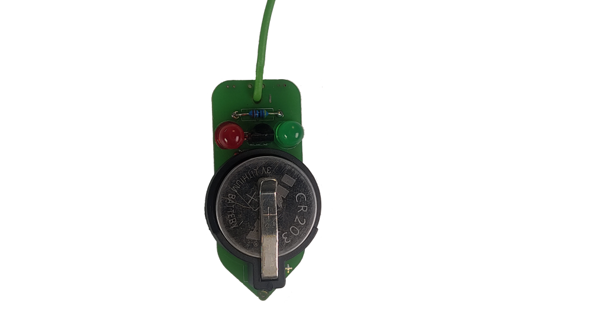
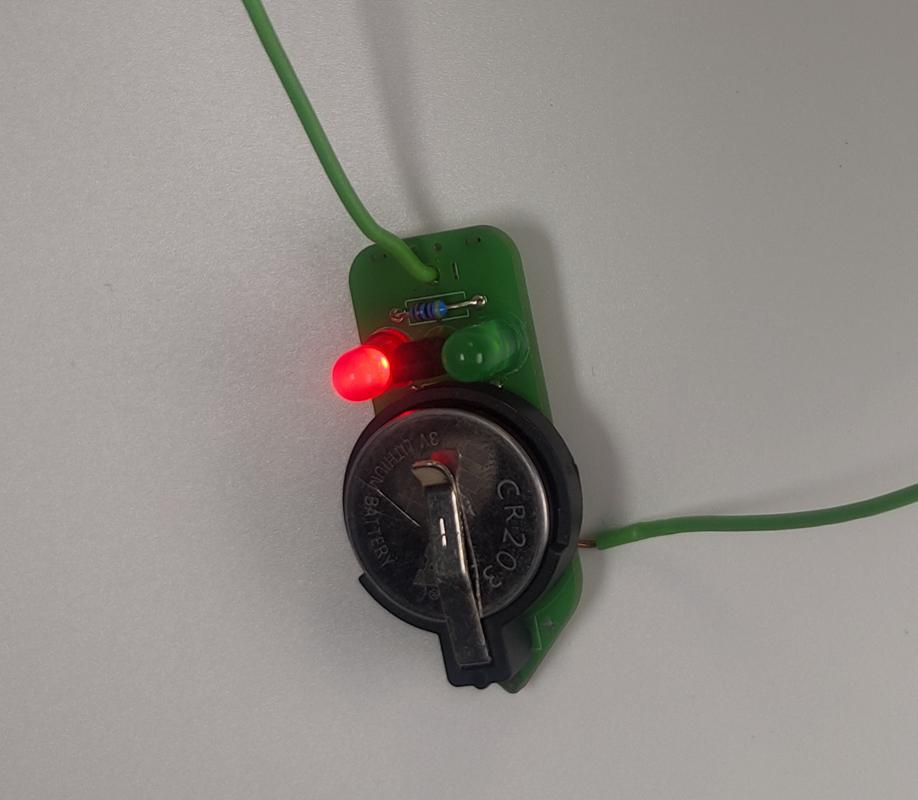

# O co jde?

[Šlusmetr](https://www.zirafoviny.cz/modules/lexikon/entry.php?entryID=227) je jednoduché elektronické zařízení, které Vám ukáže odpor nebo zkrat rozsvícením příslušné LED.
Stačí jen přiložit konec kabelu a kontakt na desce na vodič nebo obvod. Ihned se rozsvítí jedna z LED, pokud se rozsvítí zelená, tak odpor mezi sondami určuje její jas, pokud se rozsvítí červená, tak nastal zkrat.  
Výrobek převzat v rámci spolupráce s [ÚDIF](https://www.udif.cz)

