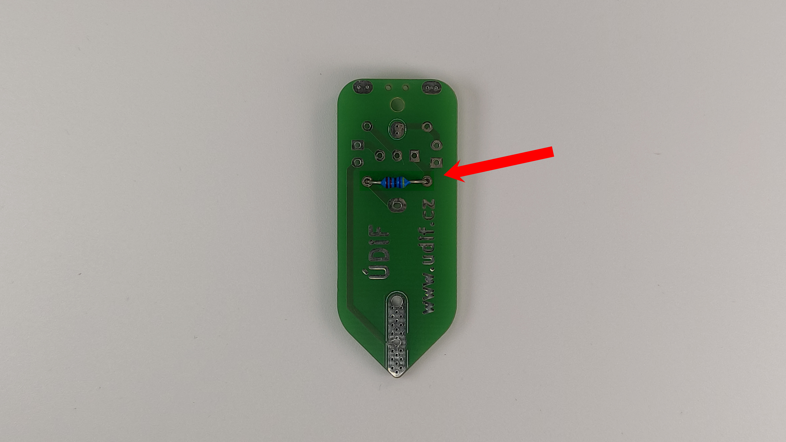
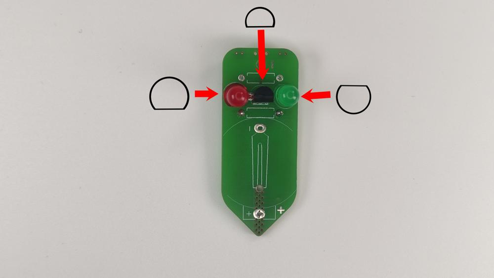
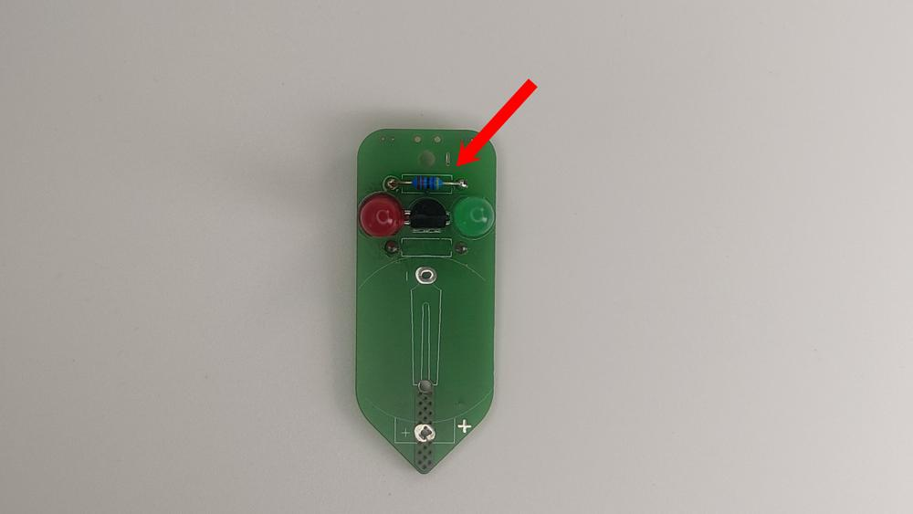
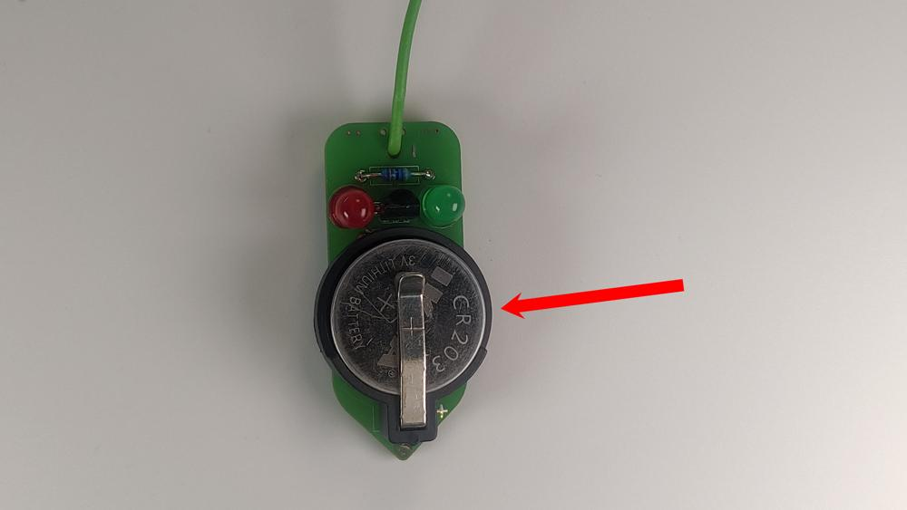
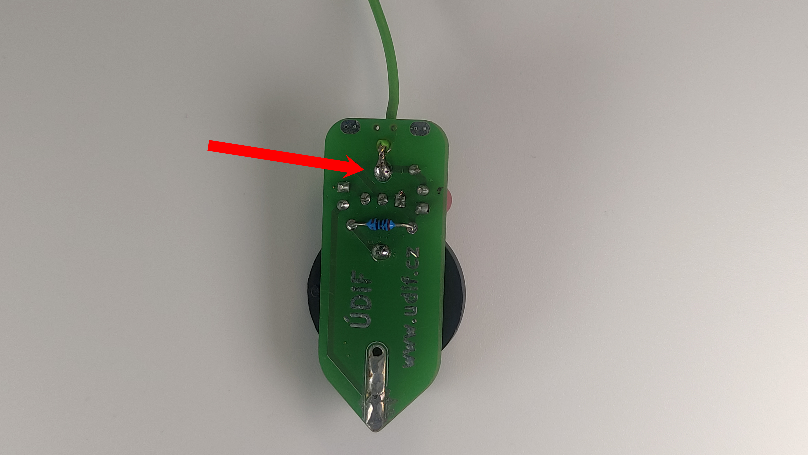

# Návod

## Potřebný materiál
- Držák na baterku
- LED červená
- LED zelená
- Odpor 4,7K Ohm
- Odpor 100 Ohm
- Drátek max. 10 cm

## Návod na složení

1. Připajíme 100Ohm odpor z druhé strany desky (s nápisem ÚDIF), do spodních dírek. **POZOR** na orientaci desky, musí být stejně jako na obrázku. Zastřihneme nožičky.  

 

2. Na horní stranu desky (bez nápisu ÚDIF) připájíme postupně zelenou LED na **pravou** stranu, transistor a červenou LED na **levou** stranu. **POZOR** na orientaci LED, dvakrát to zkontoluj!! Zastřihneme nožičky.  

 

3. Připájíme 4.7KOhm odpor na horní stranu do horních dírek. Zastřihneme nožičky.  

 

4. Na horní stranu připájíme držák na baterku. Otočení podle nákresu na desce.  

 

5. Protáhneme drátek skrz vyznačenou dírku a připájíme na kontakt.
