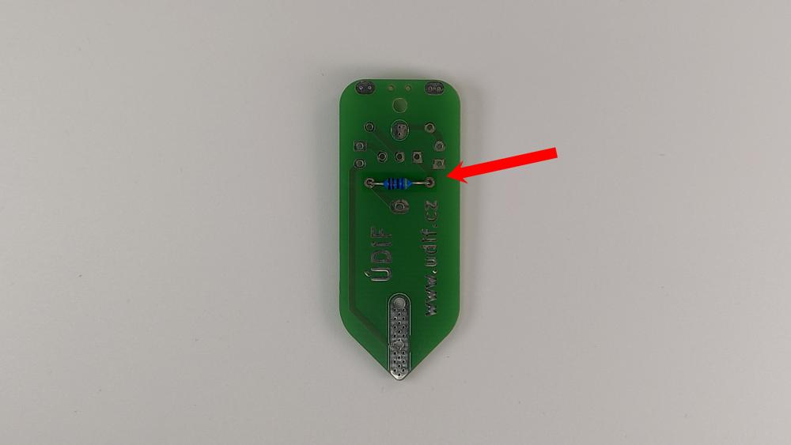

# Manuál

## Potřebný materiál
- Držák na baterku
- LED červená
- LED zelená
- Odpor 4,7K Ω
- Odpor 100 Ω
- Drátek max. 10 cm

## Návod na složení
1. Připájíme **100Ω** odpor z druhé strany desky (s nápisem ÚDIF), do spodních dírek. **POZOR** na orientaci desky, musí být stejně jako na obrázku. Zastřihneme nožičky.  
    
    

2. Na **horní stranu** desky (bez nápisu ÚDIF) připájíme postupně zelenou LED na **pravou** stranu, transistor a červenou LED na **levou** stranu. Zastřihneme nožičky.  

    !!! Pozor danger
        LED diody a transistor musí být orientované stejně, jako jsou nakreslené na desce! 
        Zelená LED musí být na pravé straně, červená na levé!

    
    

3. Připájíme 4,7KΩ odpor na horní stranu do horních dírek. Zastřihneme nožičky.  
    
    

4. Na horní stranu připájíme držák na baterku. Otočení podle nákresu na desce.  

    !!! Pozor danger
        U držáku záleží na orientaci!

    
    

5. Protáhneme drátek skrz vyznačenou dírku a připájíme na kontakt.
    

6. Užíváme si funkčního šlusmetru!
