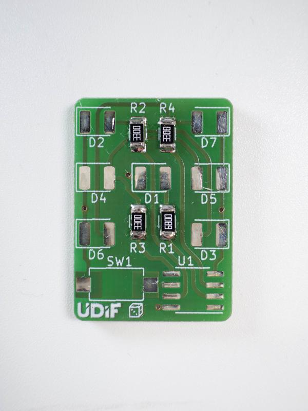
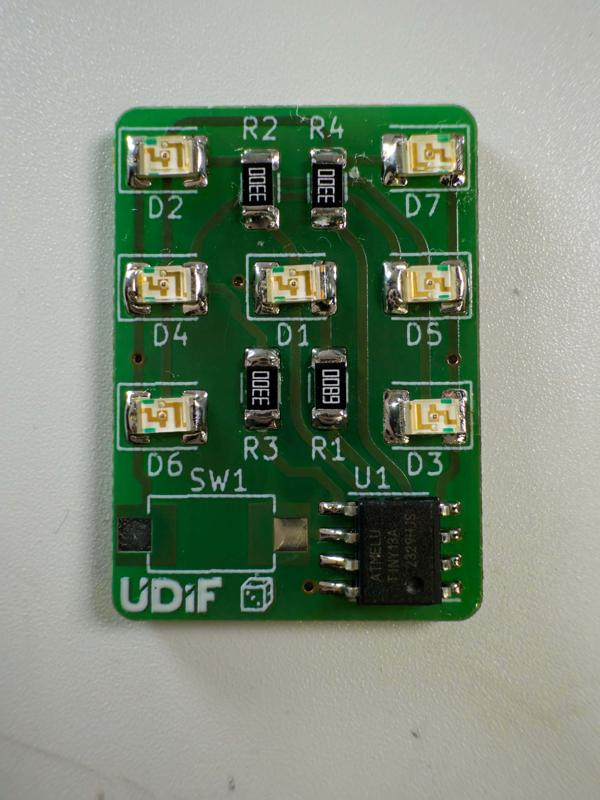

# Manuál

## Potřebný materiál
- 1x Deska plošných spojů
- 7x Smd LED
- 1x Rezistor 680 Ohm
- 3x Rezistor 330 Ohm
- 1x ATTiny
- 1x Tlačítko
- 1x Držák baterie
- 1x Baterie CR2032

## Návod na složení

1. Nožem/skalpelem oškrábáme plošky

    Na desce musíme oškrábat nevodivou vrstvu z plošek, aby se naše tlačítko lépe pájelo
    
    !!! Pozor danger
        Pozor, nůž je ostrý, tak ať se neříznete.

    
    

2. Začneme přípájením rezistorů

    ● 680Ω  
    ● 330Ω  
    
    

3. Poté přípájíme ledky

    !!! Pozor danger
        Pozor, u ledek záleží na polaritě. Zelená tečka na ledce musí směřovat **ven** (Prostřední ledka směřuje doleva). Koukni se na obrázek pokud si nejsi jistý.

    
    

4. Připájíme čip ATTiny

    !!! Pozor danger
        Pozor, když čip připájíte obráceně, nebude fungovat a riskujete zníčení čipu. Pokud si nejsi jistý, zeptej se lektora.

    
    

5. Připájíme tlačítko

    
    

6. Musíme odštípnout část pájecích plošek držáku baterie, aby se vešla na desku

      
    
    

7. Připájíme držák baterie

    !!! Pozor danger
        Pozor, když pájíte držák baterie, **celý se velmi rozehřeje** tak ho držte pinzetou nebo kleštěmi.

    
    

8. Vložíme baterii

    
    

9. Hotovo, jdeme hrát!

    